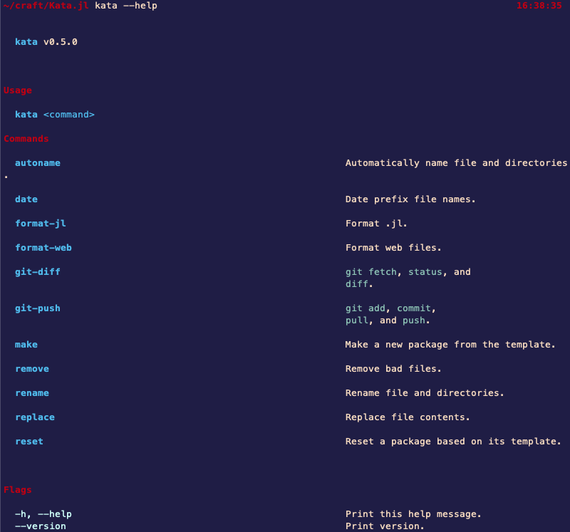

# Command-line program for the file system 🗄️✨



## Install

#### Download

```bash
git clone https://github.com/KwatMDPhD/Kata.jl
```

#### Instantiate

```bash
cd Kata.jl &&

julia --project --eval "using Pkg; Pkg.instantiate()"
```

#### Build

```bash
julia --project deps/build.jl
```

#### Path

```bash
PATH=~/.julia/bin:$PATH
```

#### Use

```bash
kata --help
```

## (Useful commands)

```bash
kata delete && kata beautify && for jl in *jl; do echo $jl; cd $jl; kata match; julia --project --eval "using Pkg; Pkg.update()"; cd ..; done && kata festdi; kata adcopu ""
```

---

Made by [Kata](https://github.com/KwatMDPhD/Kata.jl) 🥋
